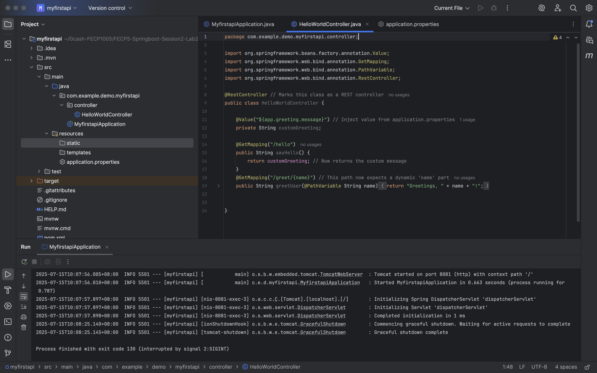
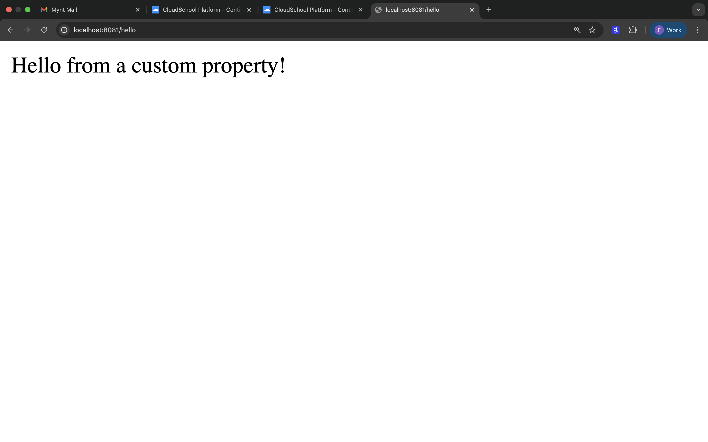
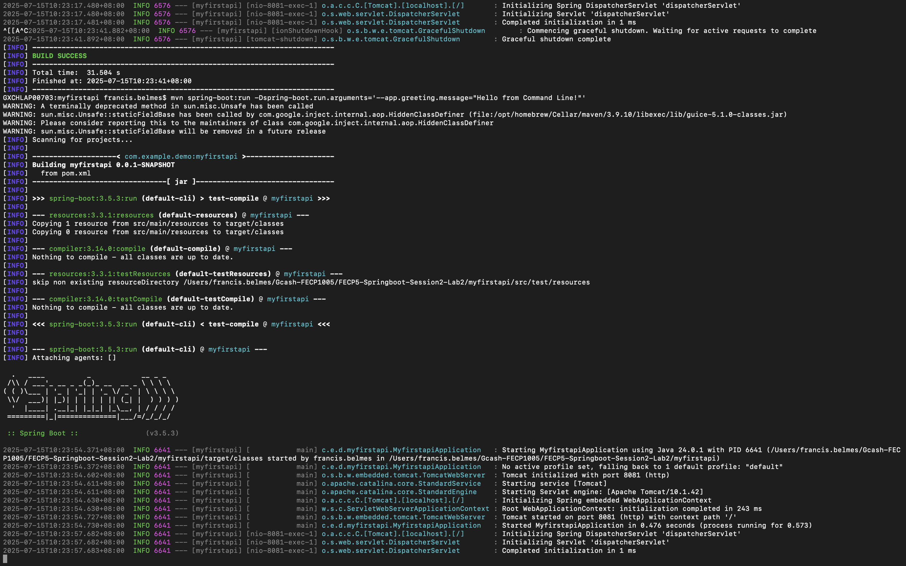
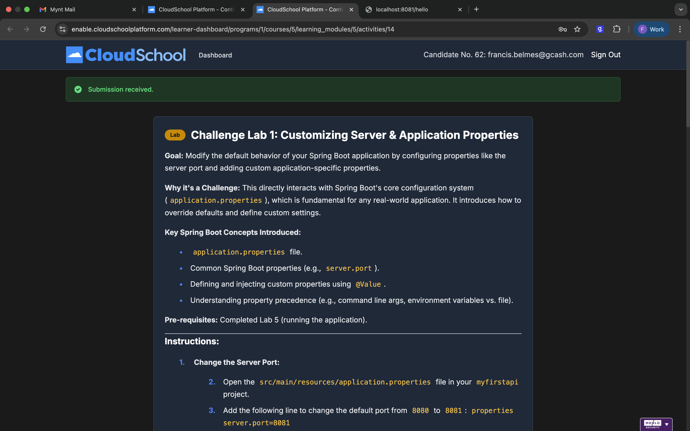

### Project Title:
Challenge Lab 1: Customizing Server & Application Properties
***
### Goal:
Modify the default behavior of your Spring Boot application by configuring properties like the server port and adding custom application-specific properties.
### Key Spring Boot Concepts Introduced:
* application.properties file.
* Common Spring Boot properties (e.g., server.port).
* Defining and injecting custom properties using @Value.
* Understanding property precedence (e.g., command line args, environment variables vs. file).

### Output:

