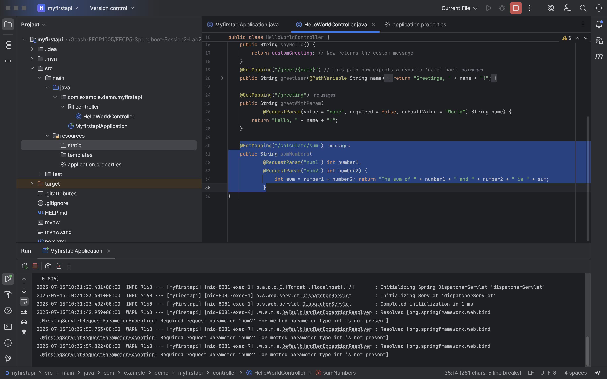
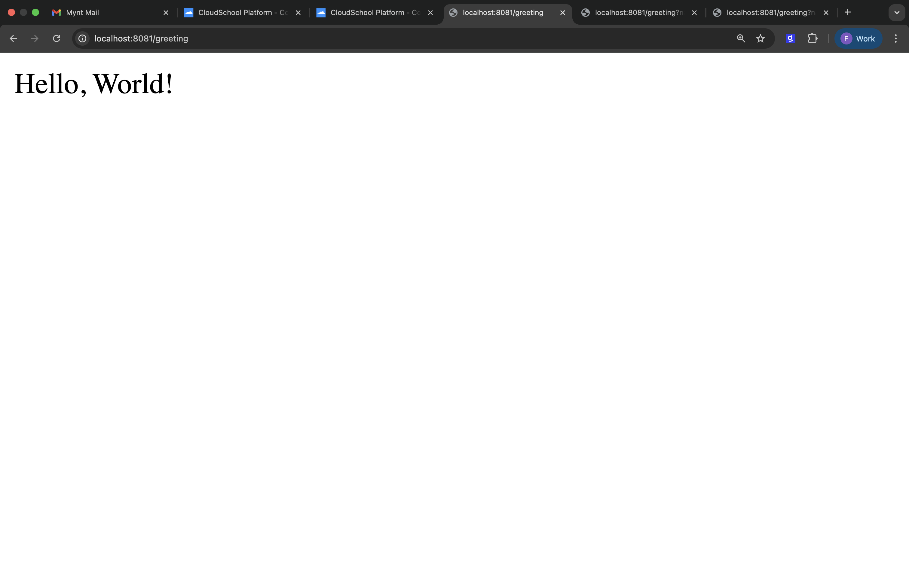
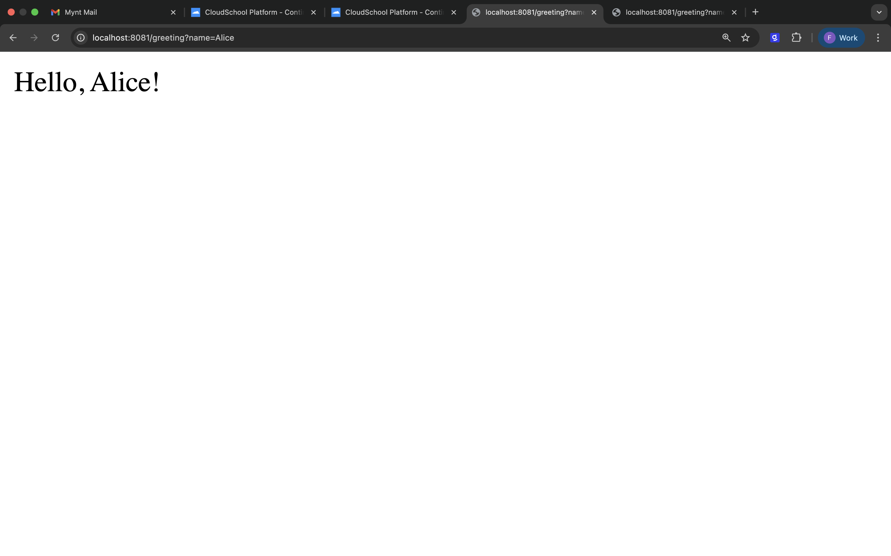
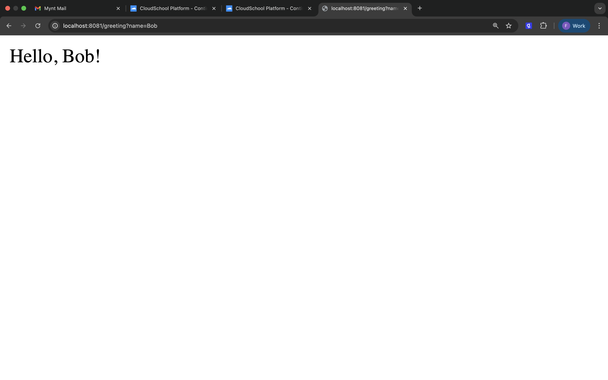
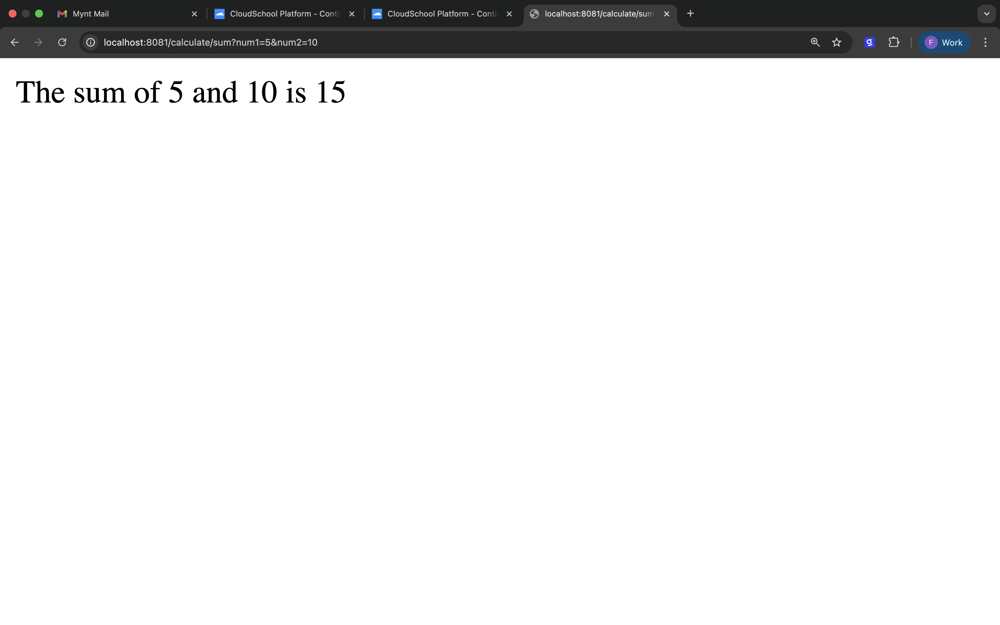
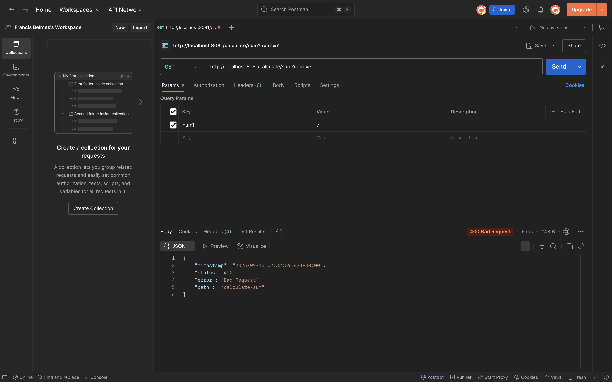
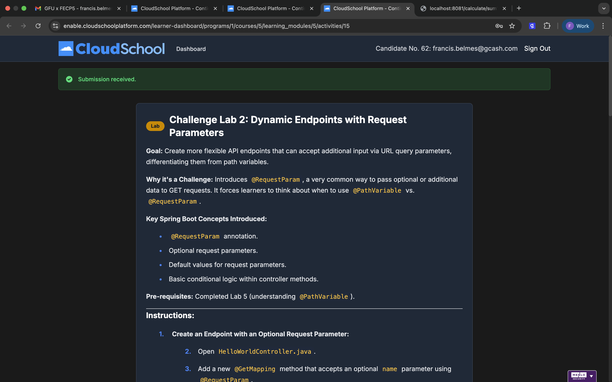

### Project Title:
Challenge Lab 2: Dynamic Endpoints with Request Parameters
***
### Goal:
Create more flexible API endpoints that can accept additional input via URL query parameters, differentiating them from path variables.
### Key Spring Boot Concepts Introduced:
* @RequestParam annotation.
* Optional request parameters.
* Default values for request parameters.
* Basic conditional logic within controller methods.

### Output:

