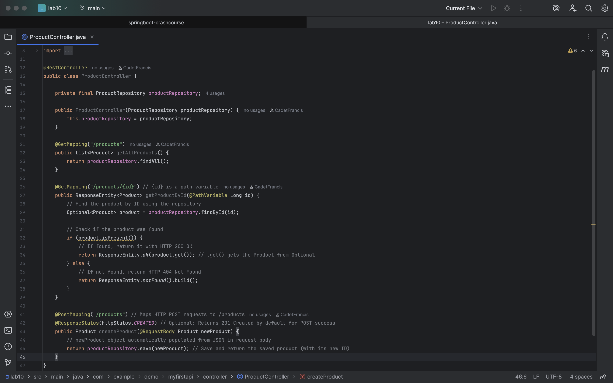
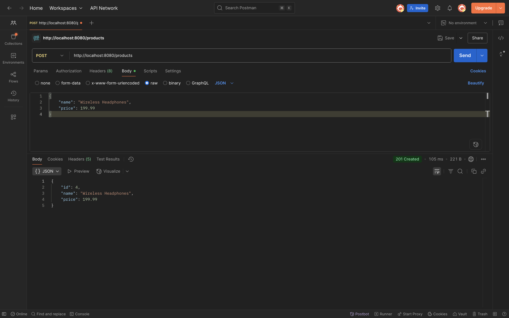
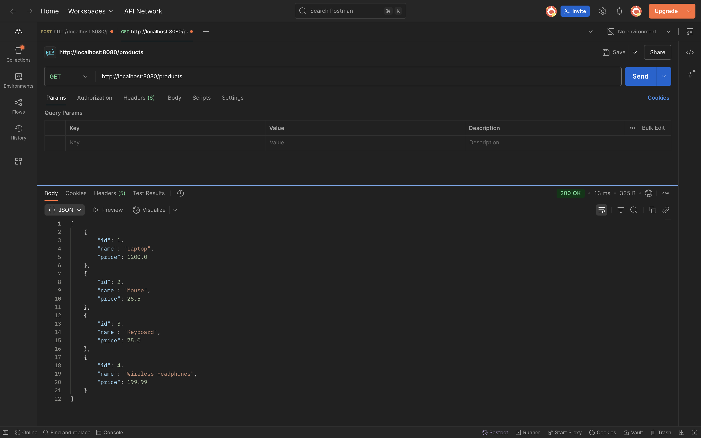

### Project Title:
Lab 10: Create POST Product Endpoint
***
### Goal:
Implement the ability to create new Product resources by handling incoming JSON data and saving it to your in-memory repository. This will introduce the crucial @RequestBody annotation.

### ProductController:

### Postman POST Request:

### Postman GET Request:

