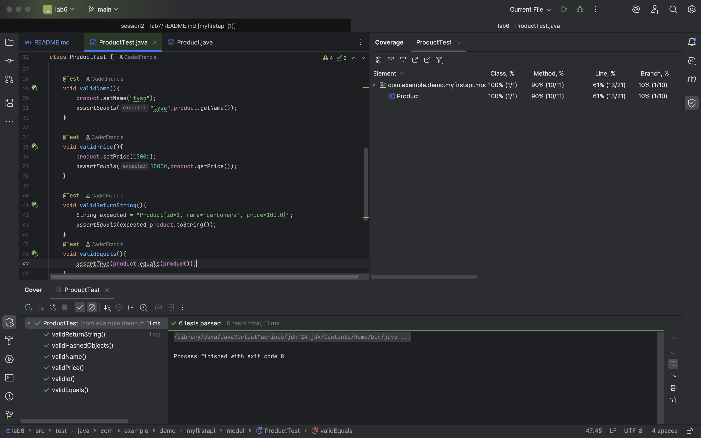
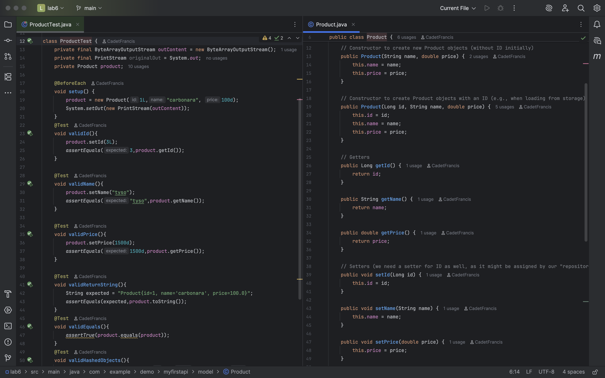

### Project Title:
Lab 6: Define Your Resource POJO (Product)
***
### Goal:
Create a simple Plain Old Java Object (POJO) to represent our Product resource. This class will hold the data that our API will manage.

### ProductTest:

### Output Test Coverage:

