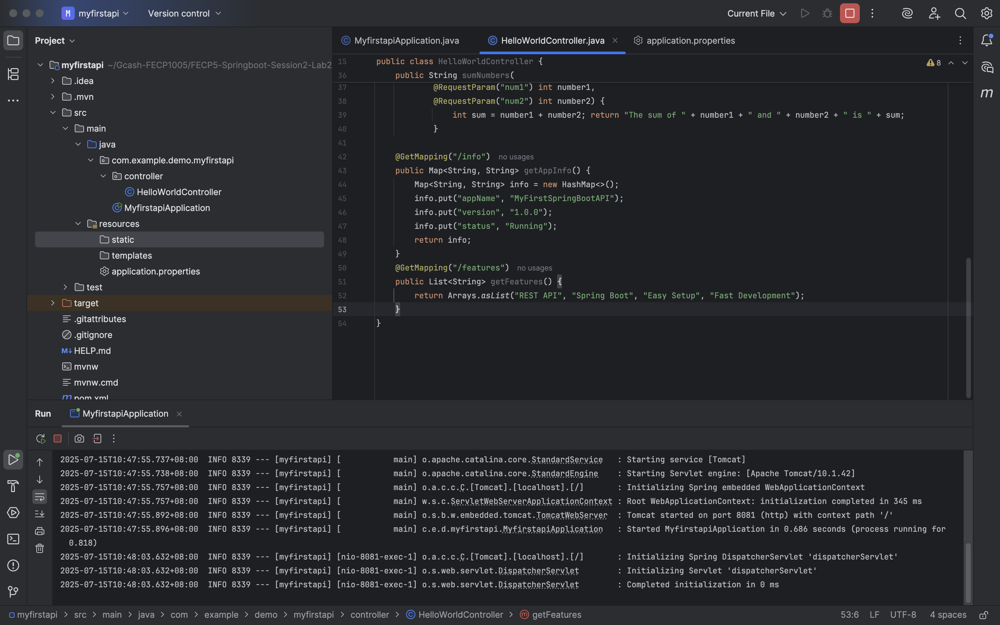
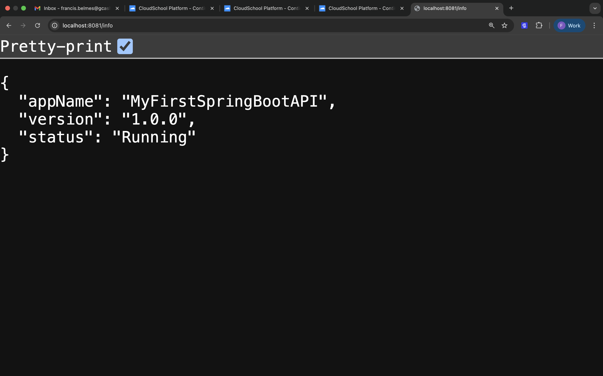
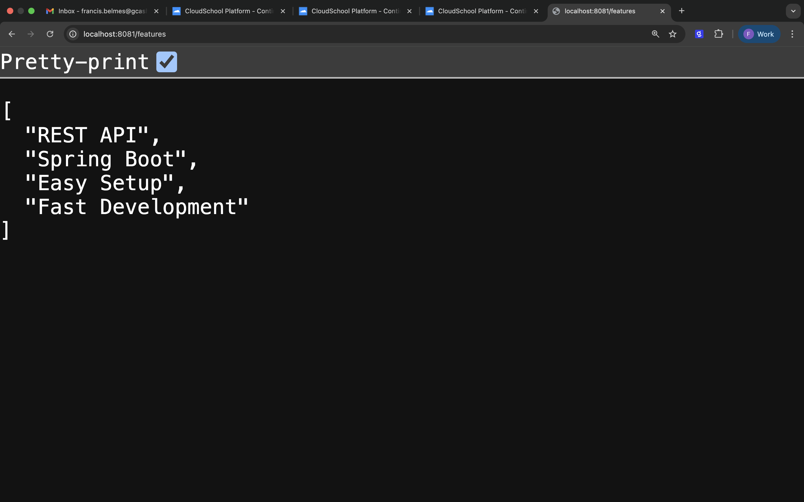
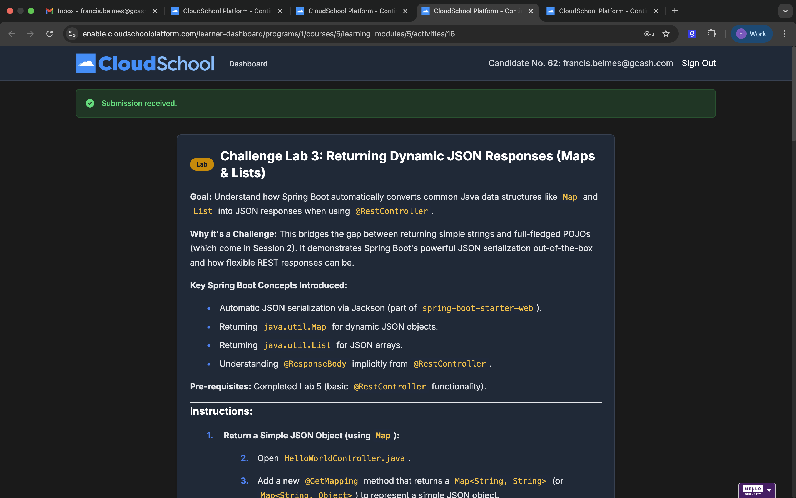

### Project Title:
Challenge Lab 3: Returning Dynamic JSON Responses (Maps & Lists)
***
### Goal:
Understand how Spring Boot automatically converts common Java data structures like Map and List into JSON responses when using @RestController.***
### Key Spring Boot Concepts Introduced:
* Automatic JSON serialization via Jackson (part of spring-boot-starter-web).
* Returning java.util.Map for dynamic JSON objects.
* Returning java.util.List for JSON arrays.
* Understanding @ResponseBody implicitly from @RestController.

### Output:

