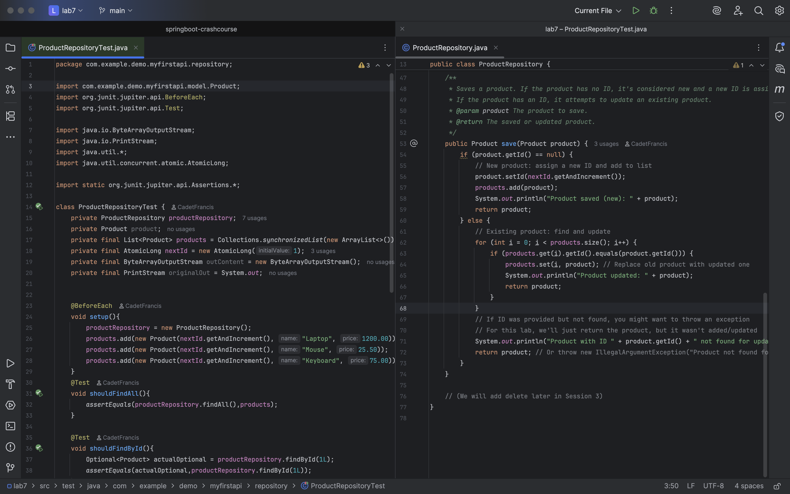
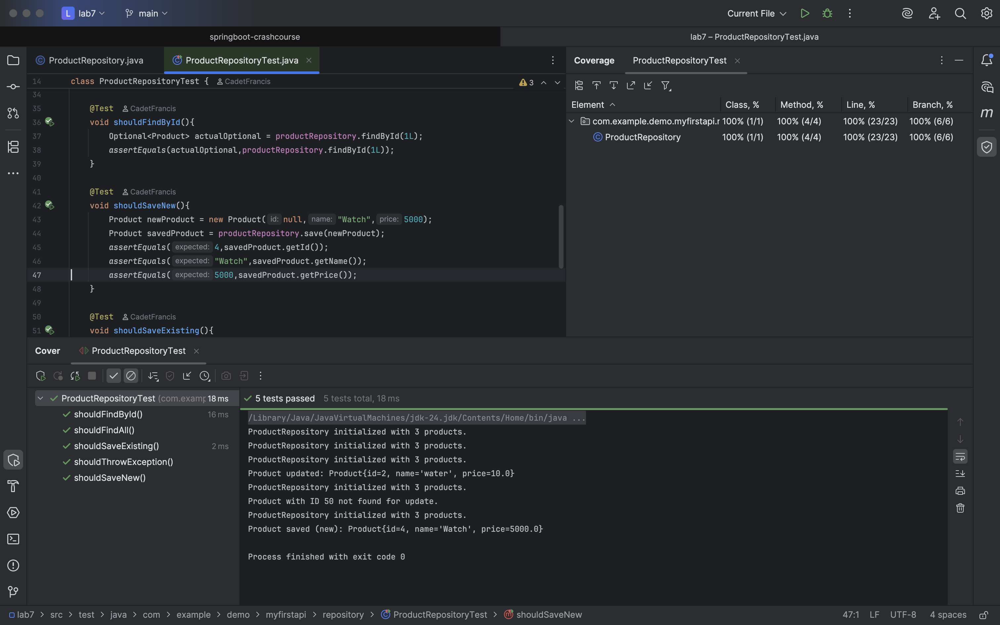

### Project Title:
Lab 7: Implement an In-Memory Data Store (ProductRepository)
***
### Goal:
Create a simple Java class that simulates a database by storing Product objects in an ArrayList. This in-memory repository will handle basic CRUD-like operations for our API without needing a real database yet.

### ProductRepositoryTest:

### Output Test Coverage:

