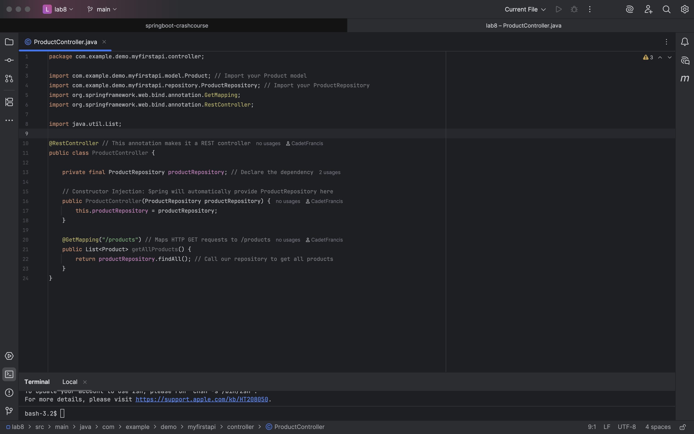
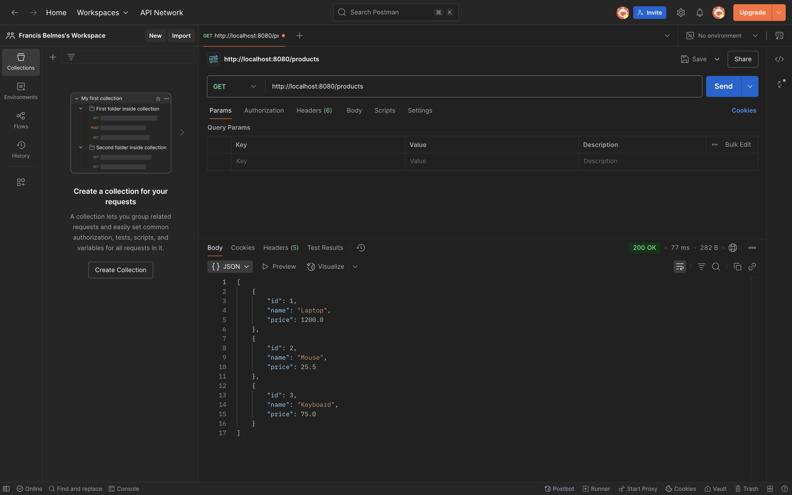

### Project Title:
Lab 8: Create GET All Products Endpoint
***
### Goal:
Create a new REST controller specifically for Product resources and expose an endpoint to retrieve all products from your in-memory data store.

### ProductController:

### Postman Output:

