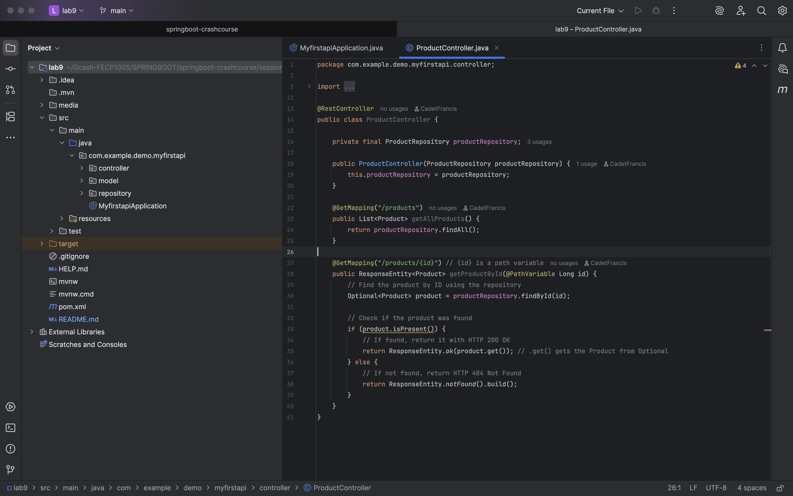
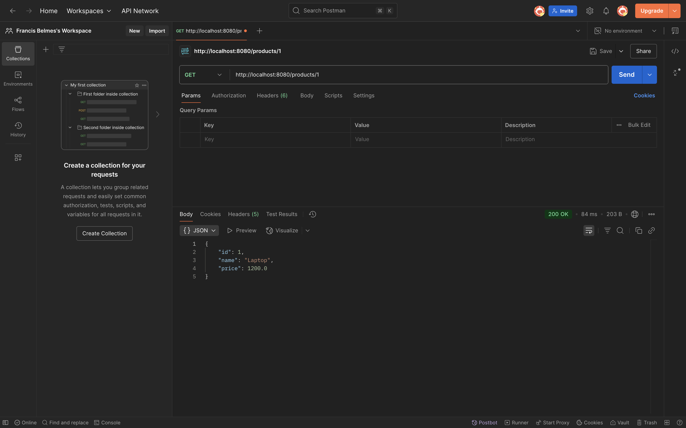
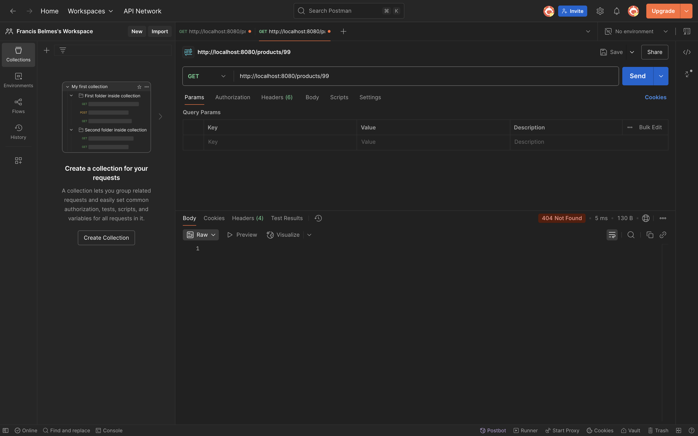

### Project Title:
Lab 9: Create GET Product by ID Endpoint
***
### Goal:
Extend your ProductController to allow clients to retrieve a single Product resource by its unique ID. This will introduce the use of @PathVariable and ResponseEntity.

### ProductController:

### Postman Valid Test:

### Postman Invalid Test:

